# ERP 系统数据库表结构说明

| 项目 | 说明 |
|------|------|
| 数据库类型 | SQLite |
| 库文件 | `backend/erp.db` |
| ORM 定义 | `backend/app/models.py` |
| 连接串 | `sqlite:///./erp.db` |
| 表数量 | 35 |
| 文档版本 | 2026-08-17 |

---

## 1. 领域总览

| 领域 | 表名 |
|------|------|
| 系统与权限 | `users` |
| 生产执行 | `work_orders`, `kanban_boards` |
| 点检设备 | `device_types`, `devices`, `inspection_plans`, `inspection_plan_items`, `inspection_records`, `inspection_record_items` |
| 设备台账与维保 | `equipment`, `equipment_maintenance_plans`, `equipment_maintenance_orders`, `equipment_repairs`, `equipment_repair_parts` |
| 设备遥测 | `equipment_runtime_logs`, `equipment_oee_snapshots`, `equipment_alarms`, `equipment_output_records` |
| 品质 | `quality_metrics`, `quality_anomalies`, `quality_defect_details` |
| 生产主数据/事实 | `production_lines`, `products`, `production_plans`, `production_output_records`, `wip_snapshots`, `line_capacity_snapshots` |
| 仓储 | `warehouses`, `warehouse_locations`, `materials`, `inventory_balances`, `inventory_transactions` |
| 销售交付 | `sales_orders`, `shipment_records` |
| 工作台 | `dashboard_todos` |

---

## 2. ER 关系图（Mermaid）

```mermaid
erDiagram
    %% ===== 点检域 =====
    device_types ||--o{ devices : "1:N"
    device_types ||--o{ inspection_plans : "1:N"
    devices ||--o{ inspection_plans : "1:N"
    devices ||--o{ inspection_records : "1:N"
    inspection_plans ||--o{ inspection_plan_items : "1:N"
    inspection_plans ||--o{ inspection_records : "1:N"
    inspection_records ||--o{ inspection_record_items : "1:N"

    %% ===== 设备台账 / 维保 / 遥测 =====
    equipment ||--o{ equipment_maintenance_plans : "1:N"
    equipment ||--o{ equipment_maintenance_orders : "1:N"
    equipment_maintenance_plans ||--o{ equipment_maintenance_orders : "1:N"
    equipment ||--o{ equipment_repairs : "1:N"
    equipment_repairs ||--o{ equipment_repair_parts : "1:N"
    equipment ||--o{ equipment_runtime_logs : "1:N"
    equipment ||--o{ equipment_oee_snapshots : "1:N"
    equipment ||--o{ equipment_alarms : "1:N"
    equipment ||--o{ equipment_output_records : "1:N"

    %% ===== 品质 =====
    quality_anomalies ||--o{ quality_defect_details : "1:N"

    %% ===== 生产 =====
    production_lines ||--o{ products : "1:N"
    production_lines ||--o{ production_plans : "1:N"
    products ||--o{ production_plans : "1:N"
    production_lines ||--o{ production_output_records : "1:N"
    products ||--o{ production_output_records : "1:N"
    work_orders ||--o{ production_output_records : "1:N"
    production_lines ||--o{ wip_snapshots : "1:N"
    products ||--o{ wip_snapshots : "1:N"
    production_lines ||--o{ line_capacity_snapshots : "1:N"

    %% ===== 仓储 =====
    warehouses ||--o{ warehouse_locations : "1:N"
    materials ||--o{ inventory_balances : "1:N"
    warehouse_locations ||--o{ inventory_balances : "1:N"
    materials ||--o{ inventory_transactions : "1:N"
    warehouse_locations ||--o{ inventory_transactions : "1:N"

    %% ===== 销售 =====
    sales_orders ||--o{ shipment_records : "1:N"
```

---

## 3. 外键关联一览

| 子表 | 外键字段 | 父表 | 父字段 | 基数 | 说明 |
|------|----------|------|--------|------|------|
| `devices` | `device_type_id` | `device_types` | `id` | N:1 | 点检设备归属类型 |
| `inspection_plans` | `device_type_id` | `device_types` | `id` | N:1 | 计划适用设备类型（可空） |
| `inspection_plans` | `device_id` | `devices` | `id` | N:1 | 计划适用单台设备（可空） |
| `inspection_plan_items` | `plan_id` | `inspection_plans` | `id` | N:1 | 点检项明细 |
| `inspection_records` | `device_id` | `devices` | `id` | N:1 | 点检执行设备 |
| `inspection_records` | `plan_id` | `inspection_plans` | `id` | N:1 | 关联计划（可空） |
| `inspection_record_items` | `record_id` | `inspection_records` | `id` | N:1 | 点检结果明细 |
| `equipment_maintenance_plans` | `equipment_id` | `equipment` | `id` | N:1 | 保养计划归属设备 |
| `equipment_maintenance_orders` | `plan_id` | `equipment_maintenance_plans` | `id` | N:1 | 来源计划（可空） |
| `equipment_maintenance_orders` | `equipment_id` | `equipment` | `id` | N:1 | 保养工单设备 |
| `equipment_repairs` | `equipment_id` | `equipment` | `id` | N:1 | 维修工单设备 |
| `equipment_repair_parts` | `repair_id` | `equipment_repairs` | `id` | N:1 | 维修配件明细 |
| `equipment_runtime_logs` | `equipment_id` | `equipment` | `id` | N:1 | 运行日志 |
| `equipment_oee_snapshots` | `equipment_id` | `equipment` | `id` | N:1 | OEE 快照 |
| `equipment_alarms` | `equipment_id` | `equipment` | `id` | N:1 | 设备告警 |
| `equipment_output_records` | `equipment_id` | `equipment` | `id` | N:1 | 设备产量 |
| `quality_defect_details` | `anomaly_id` | `quality_anomalies` | `id` | N:1 | 不良明细归属异常（可空） |
| `products` | `default_line_id` | `production_lines` | `id` | N:1 | 产品默认产线（可空） |
| `production_plans` | `production_line_id` | `production_lines` | `id` | N:1 | 计划产线 |
| `production_plans` | `product_id` | `products` | `id` | N:1 | 计划产品 |
| `production_output_records` | `production_line_id` | `production_lines` | `id` | N:1 | 产量产线 |
| `production_output_records` | `product_id` | `products` | `id` | N:1 | 产量产品（可空） |
| `production_output_records` | `work_order_id` | `work_orders` | `id` | N:1 | 关联工单（可空） |
| `wip_snapshots` | `production_line_id` | `production_lines` | `id` | N:1 | WIP 产线 |
| `wip_snapshots` | `product_id` | `products` | `id` | N:1 | WIP 产品（可空） |
| `line_capacity_snapshots` | `production_line_id` | `production_lines` | `id` | N:1 | 负荷产线 |
| `warehouse_locations` | `warehouse_id` | `warehouses` | `id` | N:1 | 库位归属仓库 |
| `inventory_balances` | `material_id` | `materials` | `id` | N:1 | 库存物料 |
| `inventory_balances` | `location_id` | `warehouse_locations` | `id` | N:1 | 库存库位（可空） |
| `inventory_transactions` | `material_id` | `materials` | `id` | N:1 | 流水物料 |
| `inventory_transactions` | `location_id` | `warehouse_locations` | `id` | N:1 | 流水库位（可空） |
| `shipment_records` | `sales_order_id` | `sales_orders` | `id` | N:1 | 发货归属销售订单 |

> **说明**：`work_orders.production_line`、`quality_metrics.production_line` 等为字符串冗余字段，与 `production_lines.name` 逻辑对应，**当前无物理外键**。`devices`（点检域）与 `equipment`（台账域）为并行主数据，暂未合并。

---

## 4. 表结构明细

字段约定：

- **PK** = 主键  
- **FK** = 外键  
- **UK** = 唯一约束  
- **NN** = 非空  

---

### 4.1 系统与权限

#### `users` — 系统用户

| 字段名 | 类型 | 约束 | 默认值 | 说明 |
|--------|------|------|--------|------|
| id | INTEGER | PK, NN | — | 主键 |
| username | VARCHAR(50) | UK, NN | — | 登录名 |
| hashed_password | VARCHAR(255) | NN | — | 密码哈希 |
| role | VARCHAR(50) | NN | `user` | 角色 |

---

### 4.2 生产执行

#### `work_orders` — 生产工单

| 字段名 | 类型 | 约束 | 默认值 | 说明 |
|--------|------|------|--------|------|
| id | INTEGER | PK, NN | — | 主键 |
| order_no | VARCHAR(50) | UK, NN | — | 工单号 |
| product_name | VARCHAR(100) | NN | — | 产品名称 |
| product_code | VARCHAR(50) | — | NULL | 产品编码 |
| production_line | VARCHAR(50) | — | NULL | 产线名称（逻辑关联） |
| plan_quantity | INTEGER | NN | — | 计划数量 |
| actual_quantity | INTEGER | NN | `0` | 实际数量 |
| status | VARCHAR(20) | NN | `pending` | `pending` / `in_progress` / `completed` / `closed` / `cancelled` |
| priority | VARCHAR(20) | NN | `normal` | 优先级 |
| assignee | VARCHAR(50) | — | NULL | 负责人 |
| start_date | DATE | — | NULL | 计划开始 |
| end_date | DATE | — | NULL | 计划结束 |
| remark | VARCHAR(500) | — | NULL | 备注 |
| created_at | DATETIME | NN | utcnow | 创建时间 |
| updated_at | DATETIME | NN | utcnow | 更新时间 |

#### `kanban_boards` — 看板配置元数据

| 字段名 | 类型 | 约束 | 默认值 | 说明 |
|--------|------|------|--------|------|
| id | INTEGER | PK, NN | — | 主键 |
| board_code | VARCHAR(50) | UK, NN | — | 看板编码 |
| board_name | VARCHAR(100) | NN | — | 看板名称 |
| category | VARCHAR(20) | NN | `production` | 分类 |
| status | VARCHAR(20) | NN | `draft` | 状态 |
| production_line | VARCHAR(50) | — | NULL | 关联产线 |
| owner | VARCHAR(50) | — | NULL | 负责人 |
| description | VARCHAR(500) | — | NULL | 描述 |
| updated_at | DATETIME | NN | utcnow | 更新时间 |

---

### 4.3 点检设备域

#### `device_types` — 点检设备类型

| 字段名 | 类型 | 约束 | 默认值 | 说明 |
|--------|------|------|--------|------|
| id | INTEGER | PK, NN | — | 主键 |
| name | VARCHAR(50) | UK, NN | — | 类型名称 |
| code | VARCHAR(20) | UK, NN | — | 类型编码 |

**关系**：1 → N `devices`；1 → N `inspection_plans`

#### `devices` — 点检设备

| 字段名 | 类型 | 约束 | 默认值 | 说明 |
|--------|------|------|--------|------|
| id | INTEGER | PK, NN | — | 主键 |
| code | VARCHAR(50) | UK, NN | — | 设备编码 |
| name | VARCHAR(100) | NN | — | 设备名称 |
| device_type_id | INTEGER | FK → `device_types.id`, NN | — | 设备类型 |
| location | VARCHAR(100) | — | NULL | 位置 |
| status | VARCHAR(20) | NN | `active` | 状态 |
| created_at | DATETIME | NN | utcnow | 创建时间 |

#### `inspection_plans` — 点检计划

| 字段名 | 类型 | 约束 | 默认值 | 说明 |
|--------|------|------|--------|------|
| id | INTEGER | PK, NN | — | 主键 |
| name | VARCHAR(100) | NN | — | 计划名称 |
| device_type_id | INTEGER | FK → `device_types.id` | NULL | 适用类型 |
| device_id | INTEGER | FK → `devices.id` | NULL | 适用设备 |
| frequency_type | VARCHAR(20) | NN | `daily` | 频率类型 |
| frequency_value | INTEGER | — | NULL | 频率值 |
| cron_expr | VARCHAR(100) | — | NULL | Cron 表达式 |
| is_active | BOOLEAN | NN | `true` | 是否启用 |
| created_at | DATETIME | NN | utcnow | 创建时间 |
| updated_at | DATETIME | NN | utcnow | 更新时间 |

#### `inspection_plan_items` — 点检计划项

| 字段名 | 类型 | 约束 | 默认值 | 说明 |
|--------|------|------|--------|------|
| id | INTEGER | PK, NN | — | 主键 |
| plan_id | INTEGER | FK → `inspection_plans.id`, NN | — | 所属计划 |
| item_name | VARCHAR(100) | NN | — | 检查项名称 |
| standard_value | VARCHAR(100) | — | NULL | 标准值 |
| judge_type | VARCHAR(20) | NN | `ok_ng` | 判定方式 |
| sort_order | INTEGER | NN | `0` | 排序 |

#### `inspection_records` — 点检记录

| 字段名 | 类型 | 约束 | 默认值 | 说明 |
|--------|------|------|--------|------|
| id | INTEGER | PK, NN | — | 主键 |
| device_id | INTEGER | FK → `devices.id`, NN | — | 设备 |
| plan_id | INTEGER | FK → `inspection_plans.id` | NULL | 计划 |
| inspector | VARCHAR(50) | NN | — | 点检人 |
| inspect_date | DATE | NN | — | 点检日期 |
| status | VARCHAR(20) | NN | `draft` | 状态 |
| remark | TEXT | — | NULL | 备注 |
| created_at | DATETIME | NN | utcnow | 创建时间 |

#### `inspection_record_items` — 点检记录项

| 字段名 | 类型 | 约束 | 默认值 | 说明 |
|--------|------|------|--------|------|
| id | INTEGER | PK, NN | — | 主键 |
| record_id | INTEGER | FK → `inspection_records.id`, NN | — | 所属记录 |
| item_name | VARCHAR(100) | NN | — | 检查项 |
| standard_value | VARCHAR(100) | — | NULL | 标准值 |
| actual_value | VARCHAR(100) | — | NULL | 实际值 |
| result | VARCHAR(10) | — | NULL | 结果 |
| remark | VARCHAR(500) | — | NULL | 备注 |

---

### 4.4 设备台账与维保

#### `equipment` — 设备台账

| 字段名 | 类型 | 约束 | 默认值 | 说明 |
|--------|------|------|--------|------|
| id | INTEGER | PK, NN | — | 主键 |
| equipment_code | VARCHAR(50) | UK, NN | — | 设备编码 |
| name | VARCHAR(100) | NN | — | 设备名称 |
| spec_model | VARCHAR(100) | — | NULL | 规格型号 |
| department | VARCHAR(50) | — | NULL | 使用部门 |
| location | VARCHAR(100) | — | NULL | 安装位置 |
| status | VARCHAR(20) | NN | `运行` | `运行` / `停机` / `待机` / `维修` |
| purchase_date | DATE | — | NULL | 采购日期 |
| commission_date | DATE | — | NULL | 投用日期 |
| supplier | VARCHAR(100) | — | NULL | 供应商 |
| remark | VARCHAR(500) | — | NULL | 备注 |
| created_at | DATETIME | NN | utcnow | 创建时间 |
| updated_at | DATETIME | NN | utcnow | 更新时间 |

**关系**：1 → N 保养计划 / 保养工单 / 维修 / 运行日志 / OEE / 告警 / 设备产量

#### `equipment_maintenance_plans` — 保养计划

| 字段名 | 类型 | 约束 | 默认值 | 说明 |
|--------|------|------|--------|------|
| id | INTEGER | PK, NN | — | 主键 |
| equipment_id | INTEGER | FK → `equipment.id`, NN | — | 设备 |
| name | VARCHAR(100) | NN | — | 计划名称 |
| cycle_type | VARCHAR(20) | NN | `day` | 周期类型 |
| cycle_value | INTEGER | NN | `1` | 周期值 |
| items | JSON | NN | `[]` | 保养项目列表 |
| status | VARCHAR(20) | NN | `enabled` | 状态 |
| next_due_at | DATETIME | — | NULL | 下次到期 |
| created_at | DATETIME | NN | utcnow | 创建时间 |
| updated_at | DATETIME | NN | utcnow | 更新时间 |

#### `equipment_maintenance_orders` — 保养工单

| 字段名 | 类型 | 约束 | 默认值 | 说明 |
|--------|------|------|--------|------|
| id | INTEGER | PK, NN | — | 主键 |
| plan_id | INTEGER | FK → `equipment_maintenance_plans.id` | NULL | 来源计划 |
| equipment_id | INTEGER | FK → `equipment.id`, NN | — | 设备 |
| order_no | VARCHAR(50) | UK, NN | — | 工单号 |
| status | VARCHAR(20) | NN | `pending` | 状态 |
| assignee | VARCHAR(50) | — | NULL | 指派人 |
| planned_start_at | DATETIME | NN | — | 计划开始 |
| actual_start_at | DATETIME | — | NULL | 实际开始 |
| actual_end_at | DATETIME | — | NULL | 实际结束 |
| executor | VARCHAR(50) | — | NULL | 执行人 |
| results | JSON | — | NULL | 执行结果 |
| remark | VARCHAR(500) | — | NULL | 备注 |
| created_at | DATETIME | NN | utcnow | 创建时间 |
| updated_at | DATETIME | NN | utcnow | 更新时间 |

#### `equipment_repairs` — 维修工单

| 字段名 | 类型 | 约束 | 默认值 | 说明 |
|--------|------|------|--------|------|
| id | INTEGER | PK, NN | — | 主键 |
| repair_no | VARCHAR(50) | UK, NN | — | 维修单号 |
| equipment_id | INTEGER | FK → `equipment.id`, NN | — | 设备 |
| fault_category | VARCHAR(50) | NN | `机械故障` | 故障类别 |
| fault_description | TEXT | NN | — | 故障描述 |
| urgency | VARCHAR(20) | NN | `normal` | `low` / `normal` / `high` / `urgent` |
| status | VARCHAR(20) | NN | `pending` | `pending` / `in_progress` / `completed` / `closed` |
| reporter | VARCHAR(50) | NN | — | 报修人 |
| repair_person | VARCHAR(50) | — | NULL | 维修人 |
| start_time | DATETIME | — | NULL | 开始时间 |
| repair_completed_at | DATETIME | — | NULL | 维修完成时间 |
| repair_description | TEXT | — | NULL | 维修说明 |
| images | JSON | — | NULL | 图片列表 |
| created_at | DATETIME | NN | utcnow | 创建时间 |
| updated_at | DATETIME | NN | utcnow | 更新时间 |

#### `equipment_repair_parts` — 维修配件

| 字段名 | 类型 | 约束 | 默认值 | 说明 |
|--------|------|------|--------|------|
| id | INTEGER | PK, NN | — | 主键 |
| repair_id | INTEGER | FK → `equipment_repairs.id`, NN | — | 维修单 |
| part_name | VARCHAR(100) | NN | — | 配件名称 |
| part_spec | VARCHAR(100) | — | NULL | 规格 |
| quantity | INTEGER | NN | `1` | 数量 |
| unit | VARCHAR(20) | NN | `个` | 单位 |
| unit_price | NUMERIC(12,2) | NN | `0` | 单价 |

---

### 4.5 设备遥测

#### `equipment_runtime_logs` — 运行时段日志

| 字段名 | 类型 | 约束 | 默认值 | 说明 |
|--------|------|------|--------|------|
| id | INTEGER | PK, NN | — | 主键 |
| equipment_id | INTEGER | FK → `equipment.id`, NN | — | 设备 |
| start_at | DATETIME | NN | — | 开始 |
| end_at | DATETIME | — | NULL | 结束 |
| status | VARCHAR(20) | NN | — | `运行` / `停机` / `待机` / `维修` |
| runtime_hours | NUMERIC(10,2) | NN | `0` | 运行小时 |

#### `equipment_oee_snapshots` — OEE 快照

| 字段名 | 类型 | 约束 | 默认值 | 说明 |
|--------|------|------|--------|------|
| id | INTEGER | PK, NN | — | 主键 |
| equipment_id | INTEGER | FK → `equipment.id`, NN | — | 设备 |
| period_type | VARCHAR(20) | NN | — | `day` / `week` / `month` |
| period_start | DATE | NN | — | 周期起始 |
| availability | NUMERIC(6,2) | NN | `0` | 可用率 % |
| performance | NUMERIC(6,2) | NN | `0` | 性能率 % |
| quality | NUMERIC(6,2) | NN | `0` | 质量率 % |
| oee | NUMERIC(6,2) | NN | `0` | 综合效率 % |

#### `equipment_alarms` — 设备告警

| 字段名 | 类型 | 约束 | 默认值 | 说明 |
|--------|------|------|--------|------|
| id | INTEGER | PK, NN | — | 主键 |
| equipment_id | INTEGER | FK → `equipment.id`, NN | — | 设备 |
| alarm_type | VARCHAR(50) | NN | — | 告警类型 |
| severity | VARCHAR(20) | NN | `normal` | 严重级别 |
| occurred_at | DATETIME | NN | — | 发生时间 |
| cleared_at | DATETIME | — | NULL | 清除时间 |
| description | TEXT | — | NULL | 描述 |

#### `equipment_output_records` — 设备产量

| 字段名 | 类型 | 约束 | 默认值 | 说明 |
|--------|------|------|--------|------|
| id | INTEGER | PK, NN | — | 主键 |
| equipment_id | INTEGER | FK → `equipment.id`, NN | — | 设备 |
| record_date | DATE | NN | — | 日期 |
| output_qty | INTEGER | NN | `0` | 产量 |

---

### 4.6 品质

#### `quality_metrics` — 品质日汇总

| 字段名 | 类型 | 约束 | 默认值 | 说明 |
|--------|------|------|--------|------|
| id | INTEGER | PK, NN | — | 主键 |
| record_date | DATE | NN | — | 日期 |
| production_line | VARCHAR(50) | NN | — | 产线（逻辑关联） |
| process | VARCHAR(50) | NN | — | 工序 |
| good_count | INTEGER | NN | `0` | 良品数 |
| defect_count | INTEGER | NN | `0` | 不良数 |
| scrap_count | INTEGER | NN | `0` | 报废数 |
| total_inspected | INTEGER | NN | `0` | 检验总数 |

#### `quality_anomalies` — 品质异常

| 字段名 | 类型 | 约束 | 默认值 | 说明 |
|--------|------|------|--------|------|
| id | INTEGER | PK, NN | — | 主键 |
| production_line | VARCHAR(50) | NN | — | 产线 |
| process | VARCHAR(50) | NN | — | 工序 |
| defect_type | VARCHAR(50) | NN | — | 缺陷类型 |
| severity | VARCHAR(20) | NN | `minor` | 严重程度 |
| status | VARCHAR(20) | NN | `open` | 状态 |
| discovered_at | DATETIME | NN | utcnow | 发现时间 |
| handler | VARCHAR(50) | — | NULL | 处理人 |

#### `quality_defect_details` — 不良明细

| 字段名 | 类型 | 约束 | 默认值 | 说明 |
|--------|------|------|--------|------|
| id | INTEGER | PK, NN | — | 主键 |
| anomaly_id | INTEGER | FK → `quality_anomalies.id` | NULL | 关联异常 |
| defect_type | VARCHAR(50) | NN | — | 缺陷类型 |
| product_code | VARCHAR(50) | NN | — | 产品编码 |
| quantity | INTEGER | NN | `0` | 数量 |
| production_line | VARCHAR(50) | — | NULL | 产线 |
| process | VARCHAR(50) | — | NULL | 工序 |

---

### 4.7 生产主数据与事实

#### `production_lines` — 产线主数据

| 字段名 | 类型 | 约束 | 默认值 | 说明 |
|--------|------|------|--------|------|
| id | INTEGER | PK, NN | — | 主键 |
| code | VARCHAR(50) | UK, NN | — | 产线编码 |
| name | VARCHAR(100) | NN | — | 产线名称 |
| workshop | VARCHAR(50) | — | NULL | 车间 |
| is_active | BOOLEAN | NN | `true` | 是否启用 |

#### `products` — 产品主数据

| 字段名 | 类型 | 约束 | 默认值 | 说明 |
|--------|------|------|--------|------|
| id | INTEGER | PK, NN | — | 主键 |
| product_code | VARCHAR(50) | UK, NN | — | 产品编码 |
| product_name | VARCHAR(100) | NN | — | 产品名称 |
| model | VARCHAR(50) | — | NULL | 型号 |
| unit | VARCHAR(20) | NN | `件` | 单位 |
| default_line_id | INTEGER | FK → `production_lines.id` | NULL | 默认产线 |

#### `production_plans` — 生产计划

| 字段名 | 类型 | 约束 | 默认值 | 说明 |
|--------|------|------|--------|------|
| id | INTEGER | PK, NN | — | 主键 |
| plan_date | DATE | NN | — | 计划日期 |
| production_line_id | INTEGER | FK → `production_lines.id`, NN | — | 产线 |
| product_id | INTEGER | FK → `products.id`, NN | — | 产品 |
| plan_qty | INTEGER | NN | `0` | 计划数量 |

#### `production_output_records` — 产量事实

| 字段名 | 类型 | 约束 | 默认值 | 说明 |
|--------|------|------|--------|------|
| id | INTEGER | PK, NN | — | 主键 |
| record_at | DATETIME | NN | — | 记录时间 |
| production_line_id | INTEGER | FK → `production_lines.id`, NN | — | 产线 |
| product_id | INTEGER | FK → `products.id` | NULL | 产品 |
| work_order_id | INTEGER | FK → `work_orders.id` | NULL | 工单 |
| process_card_no | VARCHAR(50) | — | NULL | 流程卡号 |
| actual_qty | INTEGER | NN | `0` | 实际产量 |
| area_output | NUMERIC(12,2) | NN | `0` | 面积产出 |
| defect_qty | INTEGER | NN | `0` | 不良数 |
| incoming_boards | INTEGER | NN | `0` | 来料板数 |

#### `wip_snapshots` — 在制品快照

| 字段名 | 类型 | 约束 | 默认值 | 说明 |
|--------|------|------|--------|------|
| id | INTEGER | PK, NN | — | 主键 |
| snapshot_at | DATETIME | NN | — | 快照时间 |
| production_line_id | INTEGER | FK → `production_lines.id`, NN | — | 产线 |
| product_id | INTEGER | FK → `products.id` | NULL | 产品 |
| status | VARCHAR(20) | NN | — | `待投料` / `在制` / `待检验` / `待入库` |
| quantity | INTEGER | NN | `0` | 数量 |

#### `line_capacity_snapshots` — 产线负荷快照

| 字段名 | 类型 | 约束 | 默认值 | 说明 |
|--------|------|------|--------|------|
| id | INTEGER | PK, NN | — | 主键 |
| snapshot_at | DATETIME | NN | — | 快照时间 |
| production_line_id | INTEGER | FK → `production_lines.id`, NN | — | 产线 |
| station_name | VARCHAR(100) | — | NULL | 工位名称 |
| load_rate | NUMERIC(6,2) | NN | `0` | 负荷率 % |
| capacity_utilization | NUMERIC(6,2) | NN | `0` | 产能利用率 % |

---

### 4.8 仓储

#### `warehouses` — 仓库

| 字段名 | 类型 | 约束 | 默认值 | 说明 |
|--------|------|------|--------|------|
| id | INTEGER | PK, NN | — | 主键 |
| code | VARCHAR(50) | UK, NN | — | 仓库编码 |
| name | VARCHAR(100) | NN | — | 仓库名称 |

#### `warehouse_locations` — 库位

| 字段名 | 类型 | 约束 | 默认值 | 说明 |
|--------|------|------|--------|------|
| id | INTEGER | PK, NN | — | 主键 |
| warehouse_id | INTEGER | FK → `warehouses.id`, NN | — | 仓库 |
| location_code | VARCHAR(50) | NN | — | 库位编码 |
| status | VARCHAR(20) | NN | `free` | `occupied` / `free` / `abnormal` |

#### `materials` — 物料主数据

| 字段名 | 类型 | 约束 | 默认值 | 说明 |
|--------|------|------|--------|------|
| id | INTEGER | PK, NN | — | 主键 |
| material_code | VARCHAR(50) | UK, NN | — | 物料编码 |
| material_name | VARCHAR(100) | NN | — | 物料名称 |
| category | VARCHAR(50) | NN | `其他` | 分类 |
| spec | VARCHAR(100) | — | NULL | 规格 |
| unit | VARCHAR(20) | NN | `件` | 单位 |
| safety_stock | INTEGER | NN | `0` | 安全库存 |
| max_stock | INTEGER | NN | `0` | 最大库存 |

#### `inventory_balances` — 库存余额

| 字段名 | 类型 | 约束 | 默认值 | 说明 |
|--------|------|------|--------|------|
| id | INTEGER | PK, NN | — | 主键 |
| material_id | INTEGER | FK → `materials.id`, NN | — | 物料 |
| location_id | INTEGER | FK → `warehouse_locations.id` | NULL | 库位 |
| quantity | INTEGER | NN | `0` | 库存数量 |
| updated_at | DATETIME | NN | utcnow | 更新时间 |

#### `inventory_transactions` — 库存流水

| 字段名 | 类型 | 约束 | 默认值 | 说明 |
|--------|------|------|--------|------|
| id | INTEGER | PK, NN | — | 主键 |
| material_id | INTEGER | FK → `materials.id`, NN | — | 物料 |
| location_id | INTEGER | FK → `warehouse_locations.id` | NULL | 库位 |
| txn_type | VARCHAR(20) | NN | — | `in` / `out` / `move` / `check` |
| quantity | INTEGER | NN | `0` | 数量 |
| txn_at | DATETIME | NN | — | 发生时间 |
| ref_no | VARCHAR(50) | — | NULL | 单据号 |
| remark | VARCHAR(500) | — | NULL | 备注 |

---

### 4.9 销售交付

#### `sales_orders` — 销售订单

| 字段名 | 类型 | 约束 | 默认值 | 说明 |
|--------|------|------|--------|------|
| id | INTEGER | PK, NN | — | 主键 |
| order_no | VARCHAR(50) | UK, NN | — | 订单号 |
| customer | VARCHAR(100) | NN | — | 客户 |
| due_date | DATE | NN | — | 交期 |
| status | VARCHAR(20) | NN | `open` | 状态 |
| plan_qty | INTEGER | NN | `0` | 计划数量 |
| shipped_qty | INTEGER | NN | `0` | 已发数量 |
| created_at | DATETIME | NN | utcnow | 创建时间 |

#### `shipment_records` — 发货记录

| 字段名 | 类型 | 约束 | 默认值 | 说明 |
|--------|------|------|--------|------|
| id | INTEGER | PK, NN | — | 主键 |
| sales_order_id | INTEGER | FK → `sales_orders.id`, NN | — | 销售订单 |
| ship_qty | INTEGER | NN | `0` | 发货数量 |
| shipped_at | DATETIME | NN | — | 发货时间 |

---

### 4.10 工作台

#### `dashboard_todos` — 待办事项

| 字段名 | 类型 | 约束 | 默认值 | 说明 |
|--------|------|------|--------|------|
| id | INTEGER | PK, NN | — | 主键 |
| type | VARCHAR(30) | NN | — | 类型 |
| title | VARCHAR(200) | NN | — | 标题 |
| description | VARCHAR(500) | — | NULL | 描述 |
| priority | VARCHAR(20) | NN | `medium` | 优先级 |
| link | VARCHAR(200) | — | NULL | 跳转链接 |
| status | VARCHAR(20) | NN | `open` | 状态 |
| created_at | DATETIME | NN | utcnow | 创建时间 |

---

## 5. 级联规则（ORM）

| 父实体 | 子实体 | Cascade |
|--------|--------|---------|
| `InspectionPlan` | `InspectionPlanItem` | `all, delete-orphan` |
| `InspectionRecord` | `InspectionRecordItem` | `all, delete-orphan` |
| `EquipmentRepair` | `EquipmentRepairPart` | `all, delete-orphan` |
| `QualityAnomaly` | `QualityDefectDetail` | `all, delete-orphan` |

其余关联默认为普通引用，删除父记录时需业务侧保证子记录处理。

---

## 6. 维护说明

1. **权威定义**：以 `backend/app/models.py` 为准；本文件为可读文档。
2. **建表方式**：应用启动时 `Base.metadata.create_all`；SQLite 不会自动 ALTER 已有列。
3. **种子数据**：`backend/app/main.py` + `backend/app/seed_analytics.py`。
4. **查看数据**：用 DB Browser / DBeaver 打开 `backend/erp.db`。
